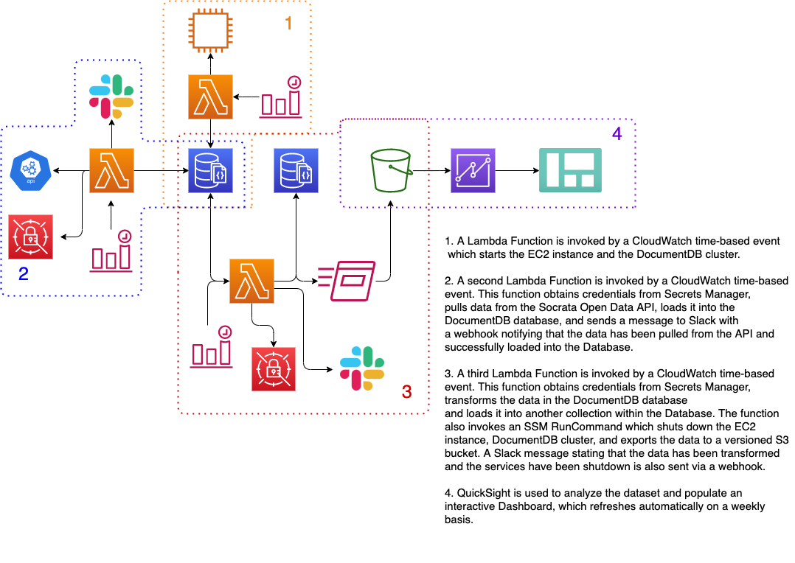
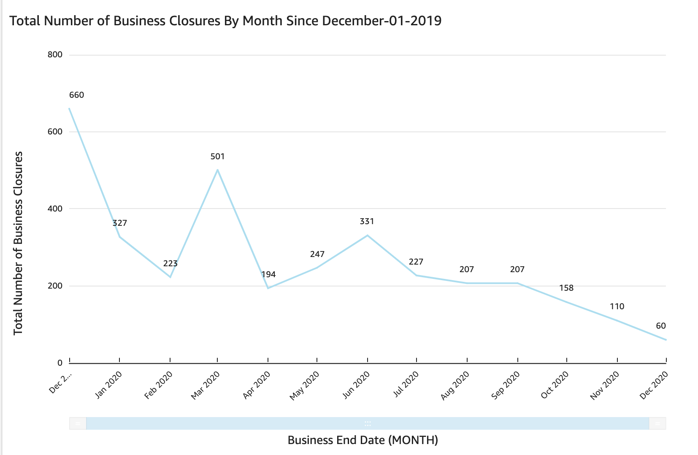
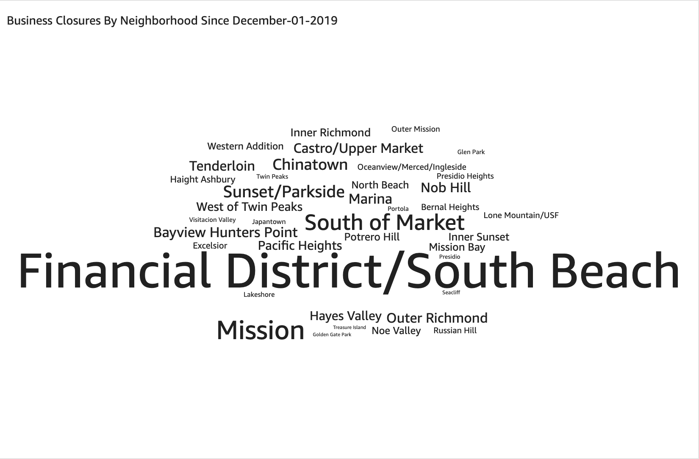
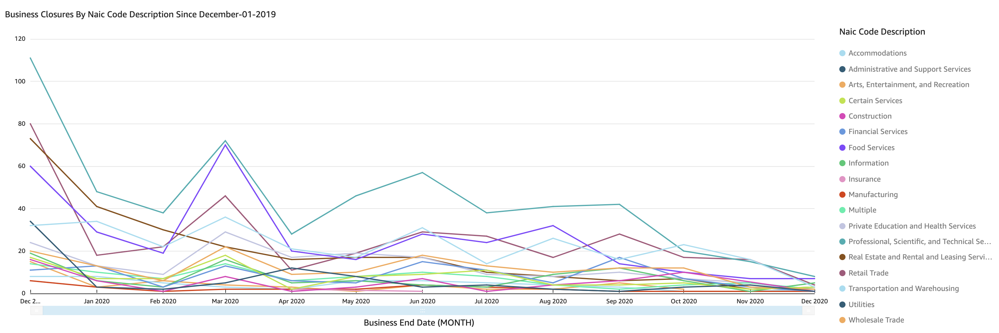
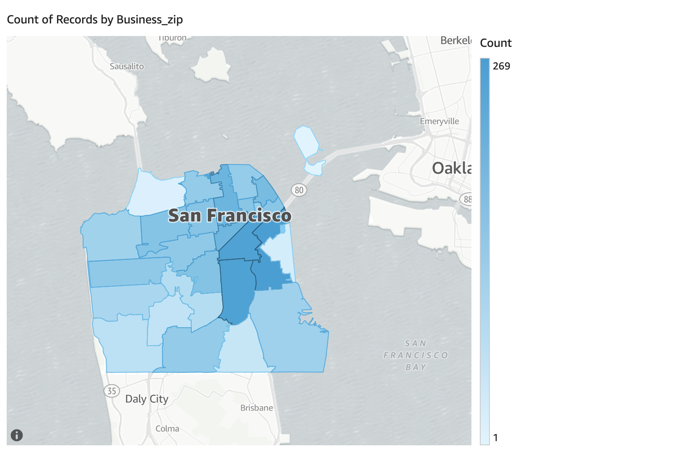

# SF-Business Closures DE Pipeline

Tracking business closures in San Francisco across corridor, zipcode, neighborhood, and naic descriptions in the months following COVID-19. Completely hosted in the AWS ecosystem with a public facing dashboard built with Amazon Quicksight.

**If you would like to replicate this project follow the walk_through.md file in the docs directory.**

## Architecture

Data is sourced from San Francisco's Open Data API (https://data.sfgov.org/Economy-and-Community/Registered-Business-Locations-San-Francisco/g8m3-pdis) as JSON documents containing information on business closures throughout San Francisco. A series of Lambda functions orchestrate the data movement and transformations throughout the pipeline. The presentation layer is created using Amazon QuickSight.

## Infrastructure
The project is housed in the AWS ecosystem and utilizes the following resources:

**VPC:**
-   Custom built VPC with two subnets (1 private, 1 public)
  - IGW, NATGW and Route Tables
  - Security Groups

**EC2:**

  - t2.micro - Resource used to SSH into the DocumentDB database, also initiates the SSM RunCommand to extract the transformed data from DocumentDB, load it into S3, and shut down the EC2 instance and DocumentDB cluster.

**DocumentDB:**

  - Engine version 4.0.0
  - db.t3.medium: Resource used for the primary instance of the database

**3 Lambda Functions**
  - 1 for starting the EC2 instance and DocumentDB cluster
  - 1 for pulling data from the API and loading it into the DocumentDB cluster
  - 1 for transforming the data, loading it to S3 and shutting down the services

**Secrets Manager**
  - For storing connection variables

**S3 Bucket with versioning enabled**
  - For storing the transformed data in JSON format

## Dashboard

## Points moving forward

I had a lot of fun building this project but I do have some things I would like to mention:

  -  This project is relatively expensive if you are not conscious about turning off the EC2 instance and the Database. I purposfully built a non-highly availble architecture in order to save on costs. Particularly the database, if I were to go with 3 instances for the database instead of 1 it would cost roughly $0.32 per hour instead of $0.08 per hour, that adds up fast if it were to be left on 24 hr. like it would be in a production setting. 
  - I am spending a little less than $10.00 a month, to keep this project running. Because, I built it with cost in mind
  - I am a little disappointed in the lack of support that DocumentDB has for MongoDB. Specifically, the fact that DocumentDB does not support either:
  * **Geospatial Geometry Specifiers:** 
    - $box
    -  $center
    -  $centerSphere
    - $nearSphere
    - $geometry
    - $maxDistance
    - $minDistance
    - $polygon
    - $uniqueDocs
    
  * **Geospatial Query Selectors:** 
    - $geoIntersects
    - $geoWithin
    - $near
    - $nearSphere
    - $polygon
    - $uniqueDocs
    
  - I origionally wanted to do some querying with some of these Geospatial operators but, since DocumentDB does not support these operators, I was unable to do that.

  - Another thing I origionally wanted to do was embed the QuickSight dashboard here in the ReadMe file. However, in order to do that I would need the Enterprise Edition of QuickSight and I would also be getting charged $0.30 per reader session. With a reader session counting as anyone who visits this page, I just was unable to spend that amount of money on this project. I wish I could've but perhaps I will look into other methods of visualization for my next project.

  - I used CloudWatch time-based events for automating the project. While I really liked the time-based events, I would like to use more CloudWatch event-based events to help cut down on costs and get some more experience with CloudWatch.

  - I had never worked with unit tests before this project but I really wanted to go all out and make this the best that I possibly could so I integrated some unit tests in order to touch on the subject. While they may not be the greatest unit tests, I belive that they are a start in the right direction. I would like to read up more on the subject before I start my next project. 
