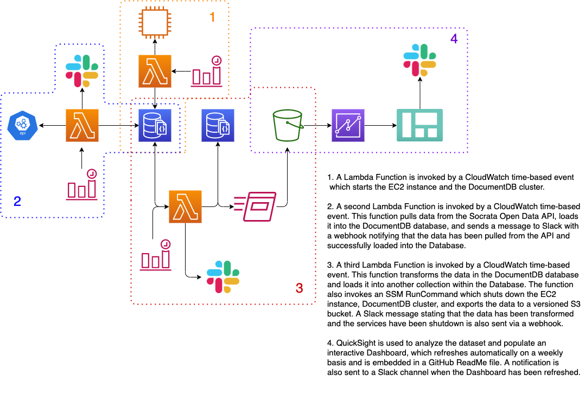

# SF-Business Closures DE Pipeline

Tracking business closures in San Francisco across corridor, zipcode, neighborhood, and naic descriptions in the months following COVID-19. Completely hosted in the AWS ecosystem with a public facing dashboard embedded in this README file.

## Architecture:

Data is sourced from San Francisco's Open Data API (https://data.sfgov.org/Economy-and-Community/Registered-Business-Locations-San-Francisco/g8m3-pdis) as JSON documents containing information on business closures throughout San Francisco. A series of Lambda functions orchestrate the data movement and transformations throughout the pipeline. The presentation layer is created using Amazon QuickSight and the Dashboard is embedded into this README file.

## ETL Flow:

## Infrastructure:
The project is housed in the AWS ecosystem and utilizes the following resources:

### EC2:

- t2.micro - Resource used to SSH into the DocumentDB database, also initiates the SSM RunCommand to extract data from DocumentDB, load it into S3, and shut down the EC2 instance and DocumentDB cluster.

### DocumentDB:

- Engine version 4.0.0
- db.t3.medium - Resource used for the primary instance of the database

## Dashboard:
